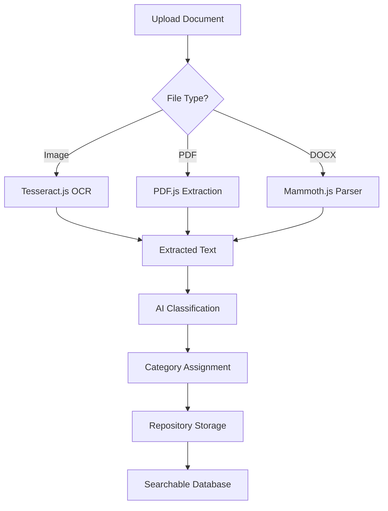

# 🚀 Web-Based Automated Document Classification System

<div align="center">


### 🎯 **AI-Powered OCR Document Classification for Accreditation Management**

*Automate document processing, classification, and repository management with intelligent OCR technology!*

[](https://codespaces.new/centmarde/thesis-template-web-reusable?quickstart=1)
[](https://vercel.com/new/clone?repository-url=https://github.com/centmarde/thesis-template-web-reusable)

</div>

---

## ✨ **What Makes This Special?**

This is an **intelligent, OCR-powered** document management system designed specifically for **accreditation project milestones**. The system automatically processes, classifies, and organizes accreditation documents into a centralized repository, eliminating manual sorting and ensuring compliance tracking.

### 🎨 **Key Innovation: OCR-Driven Document Processing**
```typescript
// Upload any document format
uploadDocument(file: File) {
  // 1. Extract text using Tesseract.js OCR
  const text = await processOCR(file)
  
  // 2. AI-powered classification
  const category = classifyDocument(text)
  
  // 3. Auto-organize in repository
  await saveToRepository(file, category, metadata)
}
```
↓ *Automatically becomes* ↓
```
📁 Accreditation Repository
  ├── 📂 Standard 1: Governance
  ├── 📂 Standard 2: Faculty
  ├── 📂 Standard 3: Curriculum
  └── 📂 Standard 4: Research
      └── ✅ Your Document (Auto-Classified)
```

---

## 🛠️ **Tech Stack & Architecture**

<table>
<tr>
<td width="50%">

### **Frontend Core**
- **🖼️ Vue 3** - Composition API with `<script setup>`
- **🎨 Vuetify 3** - Material Design components **(Styling-Only)**
- **📘 TypeScript** - Full type safety with strict config
- **⚡ Vite** - Lightning-fast dev server & builds
- **🍍 Pinia** - Intuitive state management
- **🔍 Tesseract.js** - Advanced OCR text extraction

</td>
<td width="50%">

### **Backend & Services**
- **🚀 Supabase** - Authentication & Database
- **🌐 Axios** - HTTP client for data fetching
- **🔄 Vue Router 4** - File-based auto-routing
- **🎭 Vue Toastification** - Elegant notifications
- **📋 Auto-imports** - Zero-import development
- **📄 PDF.js** - PDF text extraction
- **📝 Mammoth.js** - DOCX document processing

</td>
</tr>
</table>

### **🤖 Zero-Config Automation**
| Plugin | Purpose | Auto-Generated |
|--------|---------|----------------|
| `unplugin-vue-router` | 📁 **File-based routing** | Routes from `src/pages/*.vue` |
| `unplugin-vue-components` | 🔧 **Auto-importing** | Global components from `src/components/` |
| `vite-plugin-vue-layouts-next` | 📐 **Layout system** | Layout wrappers from `src/layouts/` |
| `unplugin-auto-import` | ⚡ **Composables** | Vue/Pinia/Router APIs without imports |
| `unplugin-fonts` | 🔤 **Typography** | Google Fonts auto-loading |

---

## 🏗️ **OCR-Powered Document Processing Architecture**

### **Document Processing Pipeline**


### **OCR Composable Pattern**
```typescript
// src/composables/fileSubmit.ts
export function useFileSubmit() {
  const selectedFile = ref<File | null>(null)
  const ocrResult = ref('')
  const fileType = ref<FileType>(null)
  
  const processOCR = async (file: File) => {
    const worker = await createWorker('eng')
    const { data } = await worker.recognize(file)
    ocrResult.value = data.text
    await worker.terminate()
  }
  
  const processPDF = async (file: File) => {
    const pdf = await pdfjsLib.getDocument({ data: arrayBuffer }).promise
    // Extract text from all pages
  }
  
  return { selectedFile, ocrResult, processOCR, processPDF }
}
```

---

## 🚀 **Quick Start**

### **Prerequisites**
- Node.js 18+ 
- npm/yarn/pnpm

### **Installation**
```bash
# Clone the repository
git clone https://github.com/centmarde/thesis-template-web-reusable.git
cd thesis-template-web-reusable

# Install dependencies
npm install

# Start development server
npm run dev
```

### **Using the OCR System**
1. **� Upload Documents**: Drag & drop or select images, PDFs, or DOCX files
2. **🔍 Automatic Processing**: OCR extracts text from all document types
3. **� View Results**: Extracted text appears in real-time
4. **💾 Save to Repository**: Classify and store documents automatically
5. **🔎 Search & Retrieve**: Find documents by content, category, or metadata

---

## 📁 **Project Structure**

```
src/
├── 📱 components/
│   ├── FIleSubmit.vue  # 🔍 OCR document processor component
│   ├── auth/           # Authentication components
│   ├── common/         # Shared UI components
│   └── [feature]/      # Feature-specific components
├── 🎛️ controller/      # Data fetching & state management
├── 🔧 composables/
│   └── fileSubmit.ts   # 📄 OCR processing logic
├── 📄 pages/           # Auto-routed page components
├── 🗃️ stores/          # Pinia state stores
├── 🎨 layouts/         # Layout wrapper components
├── � plugins/         # Vue plugin configurations
└── 📚 lib/             # Utility libraries & services
    ├── supabase.ts     # Database integration
    └── validator.ts    # Input validation

public/
└── 📊 data/
    └── external-page.json  # 🎯 Accreditation system configuration
```

---

## 💡 **Core Philosophy**

### **🎯 Intelligent Automation**
- **OCR-Powered**: Automatic text extraction from any document
- **AI Classification**: Smart categorization of accreditation materials
- **Zero Manual Filing**: Documents auto-organize by content and type
- **Compliance Ready**: Track and verify accreditation requirements

### **📄 Multi-Format Support**
- **Images**: JPG, PNG, BMP via Tesseract.js OCR
- **PDFs**: Text extraction with PDF.js
- **DOCX**: Document parsing with Mammoth.js
- **Real-Time Processing**: Instant text extraction and preview

### **🎨 User-Centric Design**
- **Drag & Drop**: Intuitive file upload interface
- **Live Preview**: See extracted text immediately
- **Copy to Clipboard**: Easy text transfer
- **Progress Tracking**: Visual feedback during processing

### **🔄 MCP-Enhanced Development**
- **Vuetify MCP**: Component API documentation
- **Context7**: External library references  
- **Sequential Thinking**: Complex problem solving
- **Playwright**: Automated UI testing

---

## 🤝 **Contributing & Recommendations**

We welcome contributions and recommendations! This project is designed to:

- **� Automate document processing** with advanced OCR technology
- **📊 Streamline accreditation** through intelligent classification
- **📱 Support cross-platform** deployment (Web, PWA, Mobile)
- **🔧 Simplify compliance** with automated tracking and reporting
- **📈 Scale efficiently** with modern Vue 3 patterns

### **Contribution Areas**
- 🤖 **AI Models**: Enhanced classification algorithms
- 🔍 **OCR Engine**: Multi-language support and accuracy improvements
- 📊 **Data Analytics**: Reporting and compliance dashboards
- 🔌 **Integrations**: Connect with accreditation bodies' APIs
- 📱 **Platform Support**: Mobile apps for on-the-go document scanning
- 📚 **Documentation**: Best practices for accreditation documentation

---

## 📄 **License**

This project is open source and available under the [MIT License](LICENSE).

---

<div align="center">

**🌟 Star this repo if it helps accelerate your development workflow!**

[🐛 Report Bug](https://github.com/centmarde/thesis-template-web-reusable/issues) • [💡 Request Feature](https://github.com/centmarde/thesis-template-web-reusable/issues) • [💬 Discussions](https://github.com/centmarde/thesis-template-web-reusable/discussions)

</div>